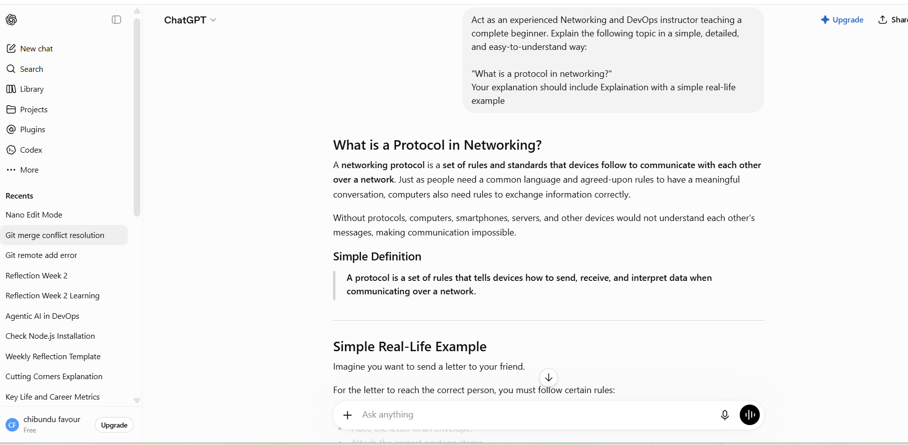

# Week 00 - Internet and Networking

Part of the DevOps Micro Internship (DMI) Cohort 3 with Agentic AI

---

# 🧑‍💻 Task 1: Using ChatGPT as Your Learning Assistant

## Scenario

You're new to DevOps and will frequently encounter technical questions. ChatGPT can be your learning companion.

## Your Task

Write a clear ChatGPT prompt to help you understand:

> "What is a protocol in networking? Explain with a simple real-life example."
A networking protocol is a set of rules and standards that devices follow to communicate with each other over a network. Just as people need a common language and agreed-upon rules to have a meaningful conversation, computers also need rules to exchange information correctly.

Real life example:
Imagine you want to send a letter to your friend.

For the letter to reach the correct person, you must follow certain rules:

Write the recipient's correct address.
Place the letter in an envelope.
Attach the correct postage stamp.
Drop it at the post office.
The postal service follows its own procedures to deliver it.

If you ignored these rules—for example, by writing no address or using the wrong format—the letter would never reach your friend.
Take a screenshot of your interaction showing:

* Your detailed prompt (with clear expectations)
* ChatGPT's simplified response with an example

## Screenshot

Save your screenshot in the `screenshots` folder and update the file name below.

![Task 1 Screenshot]


Replace `task-1-chatgpt.png` with your actual screenshot file name.

---

## What I Learned (2–3 lines)

AI learned that networking protocols are the rules that enable devices to communicate reliably over a network. Through simple examples, I gained a better understanding of why protocols are essential for data exchange and how they form the foundation of internet communication, networking, and DevOps.dd your answer here...

---

# 🌐 Task 2: Internet and Networking

## Scenario

Your friend is launching an online bookstore named **EpicReads**.

He asked you to explain how users globally can access his website hosted in Finland.

## Your Task

Write a short explanation (**100–150 words**) that includes:

* Packet Switching
* IP Address
* TCP/IP
* HTTP/HTTPS

💡 **Tip:** You may use ChatGPT (as demonstrated in Task 1) to refine your explanation.

## Answer
> When a user anywhere in the world visits *EpicReads*, their browser sends a request to the website hosted in Finland. This request is divided into small units called **packets** through a process known as **packet switching**. Each packet can travel through different network paths before being reassembled at the destination. Every device connected to the internet has a unique **IP address**, which helps route the packets to the correct server hosting the website. The **TCP/IP** protocol suite manages the communication, with TCP ensuring that all packets arrive correctly and in the proper order, while IP handles addressing and routing. Finally, **HTTPS** securely transfers data between the user's browser and the EpicReads server, protecting sensitive information and allowing users worldwide to access the online bookstore safely and reliably.


---

# 🏗️ Task 3: Application Architecture & Stack

## Scenario

EpicReads bookstore has two application versions:

### Two-Tier Application

* Frontend
* Database

### Three-Tier Application

* Frontend
* Backend
* Database

## Your Task

* Draw simple diagrams (hand-drawn or tool-based such as draw.io)
* Label each layer clearly
* List at least two common technologies or tools used for each layer
* Submit a screenshot or photo clearly showing your own drawing

## Diagram Screenshot / Photo

Save your diagram image in the `screenshots` folder and update the file name below.

 )


Replace `task-3-diagram.png` with your actual diagram file name.

---

## Technologies Used

### Frontend

* Add your answer here...HTML/CSS/JavaScript
* Add your answer here...React.js

### Backend

* Add your answer here...Node.js
* Add your answer here...Express.js

### Database

* Add your answer here...MySQL
* Add your answer here...PostgreSQL

---

# 🌍 Task 4: Domain Name & DNS (Basic Concepts)

## Scenario

Your friend's bookstore **EpicReads** is currently accessible through:

```text
52.172.142.222:3000
```

He purchased the domain:

```text
epicreads.com
```

## Your Task

In **50–100 words**, explain in your own words:

1. What is DNS (Domain Name System)?
2. Which DNS record type should be used to connect the domain to the given IP, and why?

## Answer
DNS (Domain Name System) is the internet's naming system that translates human-readable domain names (such as epicreads.com) into IP addresses (such as 52.172.142.222) that computers use to locate websites and other online services. It acts like the internet's phonebook, allowing users to access websites using easy-to-remember names instead of numerical IP addresses. Without DNS, users would have to memorize and enter IP addresses every time they wanted to visit a website.

An A (Address) record should be used to connect the domain epicreads.com to the IP address 52.172.142.222 because an A record maps a domain name directly to an IPv4 address. This allows users to access the website by typing epicreads.com into their browser instead of entering the numerical IP address.

---

# 💻 Task 5: Visual Studio Code Setup (Hands-on)

## Your Task

Install Visual Studio Code (if not already installed).

Take a screenshot of your VS Code environment showing:

* Terminal open inside VS Code
* Running a basic command:

### Windows

```powershell
dir
```

### Linux / macOS

```bash
pwd
ls
```

* Your selected VS Code theme clearly visible

⚠️ **Important:** The screenshot must show your username or another identifiable detail to confirm it is your environment.

## Screenshot

Save your screenshot in the `screenshots` folder and update the file name below.

![VS Code Setup Screenshot]


Replace `task-5-vscode.png` with your actual screenshot file name.

---

# 🔗 Task 6: Publish Your Assignment as a LinkedIn Post

## Objective

Publishing on LinkedIn helps you:

* Build your professional online presence
* Reinforce your learning
* Document your DevOps journey publicly

## Your Task

Summarize your answers from Tasks 1–5 into a LinkedIn post.

Clearly structure your post into the following sections:

* ChatGPT
* Internet & Networking
* App Architecture
* DNS
* VS Code Setup

Add the following credit note at the end of your post:

> **P.S. This post is part of the DevOps Micro Internship (DMI) with Agentic AI — Cohort 3 — by Pravin Mishra. My graded progress is public: https://dmi.pravinmishra.com/s/YOUR-GITHUB-USERNAME.html · Start your DevOps journey: https://dmi.pravinmishra.com/?utm_source=student&utm_medium=ps-linkedin&utm_campaign=cohort3**

---

## LinkedIn Post URL
https://www.linkedin.com/posts/favour-chibundu-323793353_learning-devops-cloudcomputing-activity-7396199295395237889-NfYD?utm_source=share&utm_medium=member_desktop&rcm=ACoAAFg28wsB9vXuv3Kyn9OulOUEyNs4CtNMXQs


---

## LinkedIn Post Backup Copy
I just recieved a free access from an expert trainer Pravin Mishra to join Devops for beginners training.

Below is what I learned so far;

TASK 1: How to use ChatGPT as my learning assistant and how to prompt ChatGPT, how to also get a detailed and beginner friendly explanation.

TASK 2: Internet and Networking- I learnt how devices connect and communicate,what Protocols in networking such as IP,TCP, HTTP etc is and also Packet Switching which ensures efficient and data transfer .

 TASK 3: Application Architecture & Stack -Understanding the difference between Two- tier Apps- Frontend which is directly connected to the database 
Three tier Apps-Frontend,Backend and Database separated into layers for scalability, performance and security and some common tools for each layers such as React js, mySQL/monogoDB(Database).

TASK 4: Domain Name System (DNS) - DNS translates easy to remember domain name into IP addresses that the computer use to locate each other,it is also known as the internet’s phone book.

TASK 5: Vscode Setup: Using some Basic Linux command such as pwd, dir and ls , I successfully installed some extensions and set up visual studio code for development 

I will be posting my learning experience as I deepen my knowledge into cloud computing and Devops.

P.S This post is part of the free Devops micro internship cohort run by Pravin Mishra. You can start your Devops journey for free from his YouTube playlist https://lnkd.in/euf7MuQD

hashtag#learning
hashtag#devops
hashtag#cloudcomputing


---

# Reflection – Week 0

### What did you find easy?
I found the introductory concepts easy to understand because they were explained in a practical and beginner-friendly way. Learning how to use ChatGPT as a learning assistant made it easier to break down complex topics into simple explanations. I also found the networking fundamentals, such as protocols, packet switching, and DNS, straightforward because they were supported with real-world examples. Setting up Visual Studio Code and practicing basic Linux commands gave me confidence in navigating the development environment. Overall, the hands-on approach made it easier to grasp the foundational concepts of Cloud Computing and DevOps, and I now have a solid base to build on in the coming weeks.

---

### What was difficult?
One of the most challenging parts was understanding the different networking concepts, especially how protocols such as TCP/IP, HTTP, and packet switching work together to enable communication over the internet. At first, the various layers of application architecture and the roles of the frontend, backend, and database were also a bit confusing. However, by using ChatGPT to get beginner-friendly explanations and practicing with real-world examples, these concepts became much clearer. The experience reinforced the importance of asking questions, practicing consistently, and building a strong foundation before moving on to more advanced DevOps topics.

---

### What will you improve next week?

Next week, I plan to strengthen my understanding of Linux and networking by practicing more Bash commands and exploring additional DevOps concepts. I also want to improve my hands-on skills by spending more time working on practical labs instead of only reading the theory. Additionally, I will continue using AI as a learning assistant to clarify difficult topics, reinforce my understanding, and build greater confidence as I progress in my Cloud and DevOps journey.

---

## 📌 About DMI & CloudAdvisory

DevOps Micro Internship (DMI) is a project-based DevOps program run by Pravin Mishra (The CloudAdvisory) focused on real-world execution, systems thinking, and career readiness.

It helps learners build strong DevOps foundations with hands-on experience.


## 📌 Resources

- 🌐 **DMI Official Website:** https://pravinmishra.com/dmi  
- 🎓 **DevOps for Beginners (Udemy):** https://www.udemy.com/course/devops-for-beginners-docker-k8s-cloud-cicd-4-projects/  
- 🎓 **Ultimate Agentic AI DevOps with Clude Code** https://www.udemy.com/course/ultimate-agentic-ai-devops-with-claude-code/?referralCode=448389767BC96284087B
- 🎓 **DevOps with Claude Code: Terraform, EKS, ArgoCD & Helm** https://www.udemy.com/course/devops-with-claude-code-terraform-eks-argocd-helm/?referralCode=1C5B734505D65A010FA3
- ▶️ **YouTube Playlist (DMI Cohort 3):** https://www.youtube.com/playlist?list=PLFeSNDtI4Cho  
- 🔗 **Pravin Mishra (LinkedIn):** https://www.linkedin.com/in/pravin-mishra-aws-trainer/  
- 🏢 **CloudAdvisory (LinkedIn):** https://www.linkedin.com/company/thecloudadvisory/

---

*This submission is part of DevOps Micro Internship (DMI) Cohort 3 — Agentic AI Track*