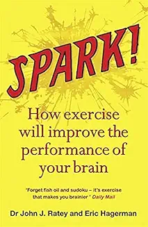

# Week 01 — Success Mindset (Mindset OS)

Part of the DevOps Micro Internship (DMI) Cohort 3 with Agentic AI

---

## Purpose (Read This First)

This week is not motivation homework.

This is you building your **Mindset OS** — the system you will use for the next 5 months (and honestly, for years).

### Expectations

* Be honest.
* Be specific.
* Be practical.
* Write like an adult professional: clear sentences, no one-liners.

You will reuse this in later weeks. So do it properly once.

---

# Assignment 1. What is something you believe to be true that most people around you would disagree with?

### Rules

* No "safe" answers.
* Must be your real belief (not copied from internet).
* Minimum 50 words.

**Hint:** What do you believe about career, money, learning, discipline, relationships, health, success, life, tech industry, etc. that most people don't agree with?

## Answer

Add your answer here...

---I believed that sucess is not about luck or talent, its about consistency and continous growth. Many people around me think suceesful people simply had better opportunities or were naturally gifted.I believe the biggest difference is their willingness to keep learning,stay disciplined and keep showing up even when the result aren't immediate.

# Assignment 2. What are the top 3 objective truths you discovered through experimentation and results?

### Definition

Objective truths do not depend on opinions. They hold true regardless of how people feel.

Write each truth in this format:

**Truth:** (1 sentence)

**Evidence from my life:** (2–4 lines: what you tried + what happened)

---

## Truth #1

### Truth

Skills create opportunities.

### Evidence from my life

Investing in high value skills has consistently opened doors that credentials alone could not,I focus on testing ideas, learning from results, and continously improving myself.

---

## Truth #2

### Truth

Failure is data, not defeat.

### Evidence from my life

Instead of seeing setbacks as reasons to quit,I've learned to analyze what went wrong,adjust my approach and try again. Every mistake brings improvement.

---

## Truth #3

### Truth

Add your answer here...
Consistency beats intensity.

### Evidence from my life

Add your answer here...
I've learned that taking small,consistent actions every day produces better long-term results than occasional bursts of effort.Whether am learning new technical skills or working towards personal goals,consistency beats intensity.

---

# Assignment 3. What does your 2.0 version look like?

### Instructions

Write as if a journalist is writing about you **3 to 7 years from now** (not 20 years).

**Minimum 300 words.**

### Rules

* Write in past tense, like it already happened.
* Don't use "likes to / wants to / hopes to."
* Use specifics:

  * built
  * shipped
  * led
  * published
  * earned
  * relocated
  * contributed
* Include skills proof:

  * projects
  * portfolios
  * GitHub
  * blogs
  * certifications
  * job role
  * leadership
  * community contribution
* Add 1–3 images if you can (optional but powerful).

### Publish It Publicly On Any ONE

* LinkedIn
* Medium
* WordPress
* Blogspot
* Personal blog
* Portfolio page

Include this line:

> **P.S. This post is part of the DevOps Micro Internship (DMI) with Agentic AI — Cohort 3 — by [Pravin Mishra](https://www.linkedin.com/in/pravin-mishra-aws-trainer/). My graded progress is public: https://dmi.pravinmishra.com/s/YOUR-GITHUB-USERNAME.html · Start your DevOps journey: https://dmi.pravinmishra.com/?utm_source=student&utm_medium=ps-blog&utm_campaign=cohort3**

## Your Article
My Version 2.0

This Was Written By A Technology Journalist About Me

Five years ago, Chibundu Favour made the bold decision to transition from Broadcast Engineering into Cloud Computing and DevOps—a move that has since defined an exceptional career.

Today, Favour is recognized as a skilled Cloud DevOps Engineer known for designing secure, scalable, and automated cloud solutions. Through expertise in cloud technologies, Infrastructure as Code (IaC), CI/CD, and DevSecOps, she has helped organizations improve efficiency, accelerate software delivery, and strengthen system reliability.

Beyond technical excellence, she is a passionate mentor dedicated to empowering aspiring Cloud and DevOps professionals across Africa. By sharing knowledge through mentorship, workshops, and community engagement, She continues to inspire others to pursue successful careers in technology.

Driven by a mindset of continuous learning, innovation, and excellence, Favour's vision extends beyond personal success—to leading global cloud transformation initiatives, building a world-class technology consultancy, and developing the next generation of technology leaders.

This is not the peak of the journey—it is only the beginning of an enduring legacy of leadership, innovation, and impact.

P.S. This post is a part of DevOps Micro Internship with Agentic AI Cohort-3 by Pravin Mishra https://lnkd.in/ew24BHvu. 
You can start your DevOps journey by joining https://lnkd.in/edZGi3AV .
Special appreciation to lead co-mentor Anjana Muthunayake  and co-mentors Nkechi Anna Ahanonye Tanisha Borana.

### Public Link

Paste your link here:

<<<<<<< HEAD:week-01-success-mindset/README.md
https://medium.com/@chibundufavour91/chibundu-favour-made-a-bold-decision-to-transition-from-broadcast-engineering-into-the-world-of-dba5d65064f6

Linkedin post link
https://www.linkedin.com/posts/favour-chibundu-323793353_chibundu-favour-made-a-bold-decision-to-transition-share-7478136779792113664-6MFs/?utm_source=share&utm_medium=member_desktop&rcm=ACoAAFg28wsB9vXuv3Kyn9OulOUEyNs4CtNMXQs
=======
`Add your URL here`
>>>>>>> upstream/main:week-01-success-mindset/assignment-01-mindset-os.md

---

# Assignment 4. Have you ever cut corners (unethical / dishonest / shortcut behavior — not necessarily illegal)? If yes, how did it make you feel?

### Important

You don't need to write the full story.

Focus on the feeling:

* guilt
* fear
* shame
* stress
* regret
* numbness
* etc.

This is about self-awareness, not judgment.

### Answer Format

Yes

If Yes:

**What emotion did you feel?** (minimum 50–100 words)

## Answer

I felt bad being dishonest.

---

# Assignment 5. What are 10 non-fiction books you plan to read in the next 1 year?

### Rules

* Mention **Title + Author**
* Any language allowed
* No fiction novels

### Tip

Choose books that improve:

* mindset
* communication
* productivity
* health
* money
* career
* leadership

## Book List

1. Atomic Habits By James Clear.

2. Deep Work By Cal Newport.

3. The Psychology Of Money By Morgan Housel.

4. Can't Hurt Me By David Goggins.

5. The Lean Startup By Eric Ries.

6. How To Win Freinds And Influence People By Dale Carnegie.

7. Thinking Fast And Slow By Daniel Kahneman.

8. Spark By John j. Ratey.

9. So Good They Can't Ignore You By Cal Newport.

10. The Power of Discipline by Daniel Walter.

---

# Assignment 6. What are the things you will measure regularly in your life and career?

### Rules

List topics only. No need to share numbers.

### Must Include

* Learning / skill
* Output / proof
* Health / energy
* Time / focus
* Money / finance (personal or business)

### Example

* Learning hours per week
* Deep work sessions per week
* Projects shipped / documented
* Steps / workouts
* Sleep hours
* Spending tracker

## My Metrics

* I will measure and keep track of how many focused hours of Learning per week.
* I will measure what i built or projects completed per week.
* I will measure how many hours spent on exercise sessions to keep fit.
* I will measure knowledged gained per week by doing what i couldn't do last week .
* I will measure my Average sleeping hours per week to maintain a healthy lifestlye .
* I will keep track on how i spend money to avoid unnessary spending.
* I will measure my Job applications and Interviews.
* I will measure my professional network growth.
* I will measure my daily and weekly goals achieved.
* I will measure books i read completely.

---

# Assignment 7. Brain Dump + 5-Month System Plan

## Step 1: Brain Dump (Private)

Do a brain dump of everything in your mind into a notebook.

Examples:

* Bills
* Tasks
* Worries
* Goals
* Pending messages
* Ideas
* Responsibilities

### Did You Do It?

**Yes / No**

Answer:

Yes.

---

## Step 2: Your 5-Month Routine + Focus Blocks

Create a simple plan you can realistically follow for the next 5 months.

### Weekly Routine

Example:

* Mon–Thu: 60 min deep work
* Sat: DMI session
* Sun: Weekly review

#### My Weekly Routine

Monday - Friday: 2hrs for each day for both Reading and Practicals.
Saturday : DMI Session which is mandatory
Sunday : Weekly Review 2 hours every sunday

---

### Focus Blocks

#### When Will You Do DMI Work? (Days + Time)

I will start doing my DMI work From Sunday till Friday at least devoting 2 hours for each day.

#### How Many Sessions Per Week?

6 sesssions per week

---

### Distraction Rules

Examples:

* Phone rules
* Social media rules
* Environment setup

#### My Distraction Rules

Making sure my phone is on Do not disturb during the DMI saturday class.
Avoiding procastination.
Avoiding late night screen time.

---

# Reflection – Week 1

### Biggest insight I got about myself this week

This week, I realized that my mindset has a direct impact on my results. Success begins with the beliefs I choose to hold and the actions I consistently take. I discovered that when I focus on growth, embrace challenges as learning opportunities, and remain disciplined, I become more confident and productive. This insight has reinforced my commitment to developing habits and a mindset that supports long-term success. Small ,consistent improvements gave me more confidence than trying to learn everything at once.I also need to protect my focus by reducing distractions during my study sessions.

### My biggest weakness/loop I noticed

I noticed that  I can be inconsistent with my study routine when my schedule gets busy.
I also noticed that I sometimes watch tutorials without spending enough time practicing what I learned.
I compare my progress with others, which sometimes affects my motivation.
I try to learn too many topics at once, which reduces my focus.
I spend too much time trying to get things perfect instead of making progress.

### One system I will implement from this week (exact habit + time)

From this week, I will study every day for 2 hours,During this time, my phone will be on Do Not Disturb, I will focus on one topic only, spend at least 1 hour on hands-on practice, and end each session with a 30-minutes review of what I learned, then plan for tomorrow.
### LinkedIn Post

Paste your LinkedIn post link here:

<<<<<<< HEAD:week-01-success-mindset/README.md
`_____ https://www.linkedin.com/posts/favour-chibundu-323793353_week-1-of-my-dmi-cohort-3agentic-ai-share-7478759110407196672-Q7_U/?utm_source=share&utm_medium=member_desktop&rcm=ACoAAFg28wsB9vXuv3Kyn9OulOUEyNs4CtNMXQs_____________________`
=======
`Add your URL here`
>>>>>>> upstream/main:week-01-success-mindset/assignment-01-mindset-os.md

---

## 10. Proof of Work

- LinkedIn Post URL: **ADD LINK HERE** 
 https://www.linkedin.com/posts/favour-chibundu-323793353_week-1-of-my-dmi-cohort-3agentic-ai-share-7478759110407196672-Q7_U/?utm_source=share&utm_medium=member_desktop&rcm=ACoAAFg28wsB9vXuv3Kyn9OulOUEyNs4CtNMXQs
- Blog / Medium : **ADD LINK HERE**  

---

## 📌 About DMI & CloudAdvisory

DevOps Micro Internship (DMI) is a project-based DevOps program run by Pravin Mishra (The CloudAdvisory) focused on real-world execution, systems thinking, and career readiness.

It helps learners build strong DevOps foundations with hands-on experience.

## 📌 Resources

- 🌐 **DMI Official Website:** https://pravinmishra.com/dmi  
- 🎓 **DevOps for Beginners (Udemy):** https://www.udemy.com/course/devops-for-beginners-docker-k8s-cloud-cicd-4-projects/  
- 🎓 **Ultimate Agentic AI DevOps with Clude Code** https://www.udemy.com/course/ultimate-agentic-ai-devops-with-claude-code/?referralCode=448389767BC96284087B
- 🎓 **DevOps with Claude Code: Terraform, EKS, ArgoCD & Helm** https://www.udemy.com/course/devops-with-claude-code-terraform-eks-argocd-helm/?referralCode=1C5B734505D65A010FA3
- ▶️ **YouTube Playlist (DMI Cohort 3):** https://www.youtube.com/playlist?list=PLFeSNDtI4Cho  
- 🔗 **Pravin Mishra (LinkedIn):** https://www.linkedin.com/in/pravin-mishra-aws-trainer/  
- 🏢 **CloudAdvisory (LinkedIn):** https://www.linkedin.com/company/thecloudadvisory/

---

*This submission is part of DevOps Micro Internship (DMI) Cohort 3 — Agentic AI Track*