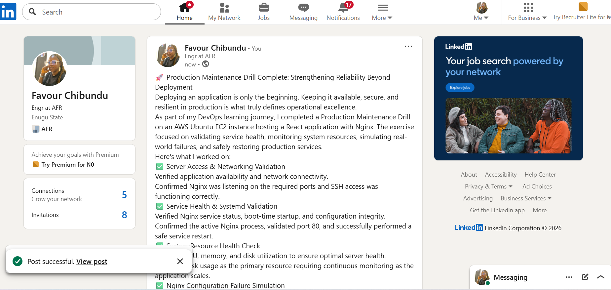

# Assignment 3 — Production Maintenance Drill (OPS Checklist)

Part of the DevOps Micro Internship (DMI) Cohort 3 with Agentic AI

---

## Purpose

In this assignment, you will treat your already deployed React application (on Ubuntu VM with Nginx) as a live production system. You will perform structured operational checks covering network validation, service health, log analysis, resource monitoring, configuration verification, and incident simulation with recovery — mirroring real on-call DevOps responsibilities.

---

# Task 1 — Server Access & Networking Validation

## Goal

Verify that the deployed React application is reachable from the browser and confirm basic network connectivity of the Ubuntu VM.

### Evidence

#### Screenshot 1 — Browser showing the React app with your Full Name visible on the UI

Add your screenshot here.

---

#### Screenshot 2 — Output of `ip a`

Add your screenshot here.

---

#### Screenshot 3 — Output of `sudo ss -tulpen`

Add your screenshot here.

---

#### Screenshot 4 — Output of `sudo ufw status`

Add your screenshot here.

---

### Notes

Answer the following in your own words:

**1. What proves Nginx is listening on 0.0.0.0:80?**

Write your answer here.
Here's a more professional and concise version of your answer:

> The sudo ss tulpen output confirms that Nginx is listening on 0.0.0.0:80. The entry tcp LISTEN 0.0.0.0:80 indicates that Nginx is bound to all IPv4 network interfaces, allowing it to accept HTTP requests from any IP address, not just the local machine. The presence of the nginx process associated with port 80 verifies that Nginx is the service actively listening for incoming web traffic on that port.

---

**2. What proves SSH is active on port 22?**

Write your answer here.
 >The sudo ss -tulpen output confirms that SSH is active on port 22 by showing the entry tcp LISTEN 0.0.0.0:22 associated with the sshd process. The LISTEN state indicates that the SSH daemon is actively waiting for incoming connections, while 0.0.0.0 means it is listening on all IPv4 network interfaces. This configuration enables secure remote access to the server using commands such as ssh ubuntu@<public-ip>.

---

**3. Did you find any unexpected open ports? Explain briefly.**

Write your answer here.
Here's a more polished and professional version of your answer:

> No unexpected open ports were found. In addition to Nginx listening on port 80 and SSH on port 22, the only other active services were chronyd (used for time synchronization) and systemd-resolved (used for DNS resolution). These services were bound only to loopback addresses (`127.0.0.1`, `127.0.0.53`, and `127.0.0.54`), making them accessible only from within the server itself and not from external networks. This confirms that only the intended services—the web server (Nginx) and SSH for remote administration—were exposed to external traffic, reflecting a secure and properly configured server.

---

# Task 2 — Service Health & Systemd Validation (Nginx)

## Goal

Verify that Nginx is properly installed, running, enabled at boot, and safely configured.

### Evidence

#### Screenshot 1 — Output of `systemctl status nginx --no-pager`

Add your screenshot here.

---

#### Screenshot 2 — Output of `sudo nginx -t`

Add your screenshot here.

---

#### Screenshot 3 — Output of `sudo ss -lptn '( sport = :80 )'`

Add your screenshot here.
.png>)
---

### Notes

Answer the following in your own words:

**1. What happens if Nginx fails to restart in production?**

Write your answer here.
 
 >If Nginx fails to restart in a production environment, it may stop serving web traffic, causing the website or application to become unavailable to users. This can result in service downtime, failed client requests, and a poor user experience. Common causes include configuration errors, port conflicts, missing files, or insufficient permissions. To minimize downtime, administrators should validate configuration changes using sudo nginx -t before restarting the service and monitor Nginx logs to quickly identify and resolve any issues.

---

**2. What's your basic rollback plan?**

Write your answer here.
> My basic rollback plan is to prevent failures before they occur and quickly restore a working configuration if a problem arises. Before making any configuration changes, I would run `sudo nginx -t` to validate the Nginx configuration syntax, as this helps identify errors before restarting the service. If Nginx fails to restart, I would immediately check `systemctl status nginx --no-pager` and `sudo journalctl -u nginx --no-pager -n 50` to identify the exact cause of the failure. If the issue is due to an incorrect configuration change, I would revert the configuration file to the last known working version—preferably from a backup or version control—then run `sudo nginx -t` again to verify the configuration before restarting Nginx with `sudo systemctl restart nginx`. Maintaining a backup of the working configuration provides a simple and reliable rollback strategy, allowing the service to be restored quickly while minimizing downtime.

---

# Task 3 — Logs & Request Trace

## Goal

Verify real traffic flow and analyze logs to understand system behavior and errors.

### Evidence

#### Screenshot 1 — Output of `sudo tail -n 30 /var/log/nginx/access.log`

Add your screenshot here.

---

#### Screenshot 2 — Output of `sudo tail -n 30 /var/log/nginx/error.log`

Add your screenshot here.

---

#### Screenshot 3 — Output of `sudo journalctl -u nginx --no-pager -n 50`

Add your screenshot here.

---

### Notes

Answer the following in your own words:

**1. Were there any errors in the logs?**

- If yes, mention 1–2 example error lines from the logs and explain what each one means in simple terms.
- If no, explain what it means if the error log is empty or shows no recent errors during your check.

Write your answer here.
 No, there were no errors in either the error log or the journalctl output. The error log returned no output at all, and the journalctl entries show only clean Started, Stopped, Reloaded, and Deactivated successfully events — no failed or exited with status lines anywhere.

---

**2. If there were no errors, what does that indicate about the system?**

Write your answer here.
> An empty error log and a clean journalctl history indicate that Nginx has been running without errors, misconfigurations, or failed service events during the period checked.** This is a positive sign of system health, but it only reflects the timeframe reviewed. Regular log monitoring is still important, as new issues can arise due to traffic, configuration changes, or other system conditions.

---

**3. Based on the access logs, were your curl requests visible in the log entries? What does that prove about traffic flow?**

Write your answer here.
> Yes. The curl request appeared in the access.log as a GET / request with a 200 status and the curl user agent. This confirms that the request successfully reached Nginx, was processed correctly, and was logged, indicating that the end-to-end request flow was working as expected.

---

# Task 4 — System Resource Health Check (Capacity Red Flags)

## Goal

Assess server capacity and detect potential performance or failure risks.

### Evidence

#### Screenshot 1 — Output of `uptime`

Add your screenshot here.

---

#### Screenshot 2 — Output of `free -h`

Add your screenshot here.

---

#### Screenshot 3 — Output of `df -h`

Add your screenshot here.

---

#### Screenshot 4 — Output of `sudo du -sh /var/* | sort -h`

Add your screenshot here.

---

### Notes

Answer the following in your own words:

**1. Which resource looks most critical right now? (CPU/load, memory, or disk) Explain why.**

Write your answer here.
> At the moment, none of the system resources appear to be under critical pressure. CPU utilization is low, memory has sufficient available capacity with no swap usage, and disk usage is at a healthy 61%. However, disk space should be monitored most closely over time, as it can gradually increase due to log files, application data, or package cache growth, potentially leading to storage issues if left unchecked.

---

**2. What happens if disk becomes 100% full in a production server?**

Write your answer here.
> If a production server's disk reaches 100% capacity, it can cause serious service disruptions.Log files can no longer be written, making troubleshooting difficult during incidents. Applications may fail to create temporary files, leading to errors or crashes, while databases may refuse write operations or risk data corruption. In severe cases, the operating system can become unstable, affecting essential functions such as remote SSH access and overall system reliability.

---

# Task 5 — Configuration & Deployment Verification

## Goal

Ensure the correct React build is deployed and Nginx is serving it properly.

### Evidence

#### Screenshot 1 — Output of `ls -lah /var/www/html | head -n 20`

Add your screenshot here.

---

#### Screenshot 2 — Output of `grep -R "Deployed by" -n /var/www/html 2>/dev/null | head`

Add your screenshot here.

---

#### Screenshot 3 — Output of `grep -n "try_files" /etc/nginx/sites-available/default`

Add your screenshot here.

---

### Notes

Answer the following in your own words:

**1. How do you confirm that the correct version of the application is deployed?**

Write your answer here.
> The correct deployment was verified through multiple checks. The contents of /var/www/html confirmed that the production React build was deployed with the expected files and correct ownership. The custom Deployed by text was found in the compiled application, confirming the latest build was live. The Nginx configuration was verified to ensure proper routing for the React application, and a successful curl request confirmed that the deployed version was being served correctly to users over HTTP.

---

# Task 6 — Nginx Configuration Failure Simulation

## Goal

Simulate a real-world Nginx misconfiguration and recover the service safely.

### Evidence

#### Screenshot 1 — Output of `sudo nginx -t` showing the syntax error (broken config)

Add your screenshot here.

---

#### Screenshot 2 — Output of `sudo nginx -t` showing syntax ok (fixed config)

Add your screenshot here.

---

#### Screenshot 3 — Output of `curl -I http://<public-ip>` confirming recovery (200 OK)

Add your screenshot here.

---

### Notes

Answer the following in your own words:

**1. What caused the configuration failure?**

Write your answer here.
>The configuration failure was caused by two missing semicolons in the Nginx configuration file /etc/nginx/sites-available/default. These syntax errors prevented Nginx from parsing the configuration correctly, causing the service to fail during configuration validation and restart.

**2. How did you fix the issue?**

Write your answer here.
>The issue was resolved by restoring the missing semicolons in the Nginx configuration file and validating the syntax with sudo nginx -t.After confirming the configuration was valid, Nginx was restarted, and a curl -I request verified that the application was once again serving correctly with a successful 200 OK response.

---

**3. How can you avoid this kind of issue in real production systems?**

Write your answer here.
>To prevent this type of issue in production, I would always validate the Nginx configuration with nginx -t before restarting the service, store configuration files in version control for easy rollback, test changes in a staging environment, and automate configuration validation within the CI/CD pipeline to catch errors before they reach production.

---

# Task 7 — Web Application Failure Simulation

## Goal

Simulate missing deployment content and recover the application safely.

### Evidence

#### Screenshot 1 — Output of `curl -I http://<public-ip>` showing failure (non-200 response)

Add your screenshot here.

---

#### Screenshot 2 — Output of `curl -I http://<public-ip>` confirming recovery (200 OK)

Add your screenshot here.

---

### Notes

Answer the following in your own words:

**1. What caused the application to break in this scenario?**

Write your answer here
The application failed because the Nginx web root /var/www/html was empty. Although Nginx was running and properly configured, the required React application files, including the fallback index.html, were missing. As a result, Nginx could not serve the application and returned a 500 Internal Server Error.

---
---

**2. How did you fix the issue and restore the application?**

Write your answer here.
The issue was resolved by restoring the backed-up deployment files to the Nginx web root /var/www/html. After restoring the files, Nginx was restarted, and the application was verified using curl -I, which returned a 200 OK response. Matching response headers confirmed that the correct version of the application had been successfully restored and was being served properly.
---

**3. What steps would you take to prevent this kind of issue in real production systems?**

Write your answer here.
To prevent this issue in production, I would implement automated backups before each deployment, use versioned releases with atomic symlink switching instead of overwriting the live directory, and include CI/CD validation checks to verify that deployment files are present and correct. I would also enable post-deployment health checks and monitoring to immediately detect any issues and ensure the application is serving a healthy 200 OK response.

---

# Task 8 — Security & Reliability Review

## Goal

Review and reflect on the security and reliability practices applied during this assignment.

### Security & Reliability Notes

Answer the following in your own words:

**1. Why is SSH key-based authentication more secure than sharing passwords?**

Write your answer here.
>SSH key-based authentication is more secure than sharing passwords because it uses a cryptographic key pair instead of a password that can be guessed, stolen, or reused. The private key remains securely on the user's device, while only the public key is stored on the server. This reduces the risk of brute-force attacks, phishing, and password theft. Additionally, SSH keys provide stronger authentication and make it easier to manage secure, password-free access to production servers.

---

**2. Why should only required ports be open on a production server?**

Write your answer here.
> Only the required ports should be open on a production server to minimize the system's attack surface and improve security. Unnecessary open ports can expose services to unauthorized access and increase the risk of cyberattacks. By allowing only essential ports, such as 22 for SSH and 80/443 for web traffic, the server is better protected while still providing the services needed for normal operation.

---

**3. Why is it important for Nginx to be enabled on boot?**

Write your answer here.
>Enabling Nginx to start on boot ensures that the web server automatically starts whenever the server is restarted or recovers from a reboot. This minimizes downtime, keeps the application consistently available without manual intervention, and helps maintain service reliability in a production environment.

---

**4. What are the risks of sharing secrets, keys, or credentials publicly?**

Write your answer here.
> Sharing secrets, SSH keys, API keys, or credentials publicly can lead to unauthorized access, data breaches, and system compromise.Attackers can use exposed credentials to access servers, steal sensitive information, modify or delete resources, or incur unexpected costs. To reduce these risks, sensitive information should never be stored in public repositories or shared openly, and should instead be managed securely using secret management tools or environment variables.

---

**5. Why should cloud resources be stopped or terminated when they are no longer needed?**

Write your answer here.
>Cloud resources should be stopped or terminated when they are no longer needed to avoid unnecessary costs and improve resource management.Leaving unused resources running can result in ongoing charges, consume cloud capacity, and increase the potential attack surface. Regularly shutting down or deleting unused resources helps optimize costs, enhances security, and ensures a clean, efficient cloud environment.

---

# LinkedIn Post (Required)

## Evidence

#### LinkedIn Post URL

Paste your LinkedIn post URL here:

<<<<<<< HEAD:week-03-linux-for-devops/assignment-03-production-maintenance-drill-ops-checklist.md
`https://www.linkedin.com/posts/favour-chibundu-323793353_devops-aws-ec2-activity-7483482423679410176-mfbj?utm_source=share&utm_medium=member_desktop&rcm=ACoAAFg28wsB9vXuv3Kyn9OulOUEyNs4CtNMXQs`
=======
`Add your URL here`
>>>>>>> upstream/main:week-03-linux-and-bash-for-devops/assignment-03-production-maintenance-drill-ops-checklist.md

---

#### Screenshot — Published LinkedIn post

Add your screenshot here.

---

# Submission Instructions

- Add all required screenshots in your submission
- Full name must be visible in required screenshots
- Do not expose sensitive information (keys, passwords, account IDs)

---

# Completion Checklist

- [ ] Task 1: Screenshots (browser, ip a, ss -tulpen, ufw status) + Notes answered
- [ ] Task 2: Screenshots (nginx status, nginx -t, ss port 80) + Notes answered
- [ ] Task 3: Screenshots (access log, error log, journalctl) + Notes answered
- [ ] Task 4: Screenshots (uptime, free -h, df -h, du -sh) + Notes answered
- [ ] Task 5: Screenshots (ls html, grep deployed by, grep try_files) + Notes answered
- [ ] Task 6: Screenshots (nginx -t fail, nginx -t pass, curl recovery) + Notes answered
- [ ] Task 7: Screenshots (curl failure, curl recovery) + Notes answered
- [ ] Task 8: Security & Reliability Notes answered
- [ ] LinkedIn post published and URL submitted
- [ ] Full Name visible in all required screenshots
- [ ] No sensitive data exposed

---

## 📌 About DMI & CloudAdvisory

DevOps Micro Internship (DMI) is a project-based DevOps program run by Pravin Mishra (The CloudAdvisory) focused on real-world execution, systems thinking, and career readiness.

It helps learners build strong DevOps foundations with hands-on experience.

---

## 📌 Resources

- 🌐 DMI Official Website: https://pravinmishra.com/dmi  
- 🎓 DevOps for Beginners (Udemy): https://www.udemy.com/course/devops-for-beginners-docker-k8s-cloud-cicd-4-projects/  
- 🎓 Agentic AI DevOps with Claude Code: https://www.udemy.com/course/ultimate-agentic-ai-devops-with-claude-code/  
- 🎓 DevOps with Claude Code: Terraform, EKS, ArgoCD & Helm: https://www.udemy.com/course/devops-with-claude-code-terraform-eks-argocd-helm/  
- ▶️ YouTube Playlist: https://www.youtube.com/playlist?list=PLFeSNDtI4Cho  
- 🔗 Pravin Mishra (LinkedIn): https://www.linkedin.com/in/pravin-mishra-aws-trainer/  
- 🏢 CloudAdvisory (LinkedIn): https://www.linkedin.com/company/thecloudadvisory/

---

*This submission is part of DevOps Micro Internship (DMI) Cohort 3 — Agentic AI Track.*