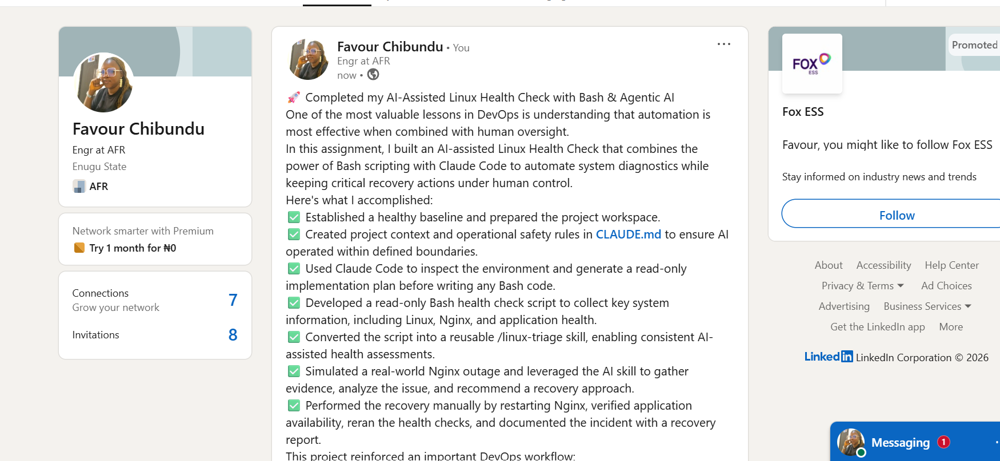

# Assignment 6 — Build an AI-Assisted Linux Health Check (AI-Assisted Linux Incident Triage)

Part of the DevOps Micro Internship (DMI) Cohort 3 with Agentic AI

---

## Purpose

>In this assignment, you will build a read-only Bash triage script that checks the health of your Ubuntu server and Nginx application, connect it to Claude Code as a reusable `/linux-triage` skill, simulate a controlled Nginx incident, use the skill to gather and analyze evidence, recover the service manually, and verify recovery. The workflow follows the Agentic Loop: Gather → Analyze → Human Act → Verify.

---

# Task 1 — Confirm the Healthy Baseline and Create the Workspace

## Goal

Confirm that Nginx and the React application are healthy before building the automation.

### Evidence

#### Screenshot 1 — Output of `systemctl is-active nginx`, `ss -ltn | grep ':80'`, and `curl -I http://localhost`

Add your screenshot here.

---

#### Screenshot 2 — Output of `pwd` and `find . -maxdepth 4 -type d | sort` showing the workspace folder structure

Add your screenshot here.
>
---

### Notes

Answer the following in your own words:

**1. What proves that Nginx is running?**

Add your answer here.
>When I run systemctl is-active nginx, it returns active. This confirms that Nginx is running.

---

**2. What proves that the server is listening for HTTP traffic?**

Add your answer here.
>The server is proven to be listening for HTTP traffic by the ss -tulpen output, which shows tcp LISTEN 0.0.0.0:80 associated with the Nginx process. This indicates that Nginx is actively listening on port 80 across all network interfaces and is ready to accept incoming HTTP requests.
---

**3. Why must you capture a healthy baseline before simulating an incident?**

Add your answer here.
>It is important to capture a healthy baseline before simulating an incident to establish a known-good state of the system. This confirms that the application and services are functioning correctly before any changes are made. After the incident is simulated, the failed state can be compared with the healthy baseline to identify what changed. Once the issue has been resolved, the same checks can be repeated to verify that the system has been fully restored to its normal operating condition.
---

# Task 2 — Create Project Context and Safety Rules in CLAUDE.md

## Goal

Tell Claude exactly what this project does and what it is not allowed to do.

### Evidence

#### Screenshot 3 — CLAUDE.md open in VS Code showing all four sections (Project Overview, Incident Workflow, Safety Rules, Output Rules)

Add your screenshot here.
>
---

### Notes

Answer the following in your own words:

**1. Why should Claude receive project-specific operational rules?**

Add your answer here.
>Claude should receive project-specific operational rules so it can provide accurate, consistent, and context-aware assistance. These rules help ensure that recommendations and actions align with the project's standards, workflows, and safety requirements. By understanding project-specific guidelines, Claude can reduce errors, follow best practices, and generate responses that are more relevant to the team's operational processes.
---

**2. Why is the human required to execute the recovery command?**

Add your answer here.
> The human is required to execute the recovery command because recovery actions can directly affect production systems. Requiring human approval ensures that the proposed fix is reviewed and verified before it is applied, reducing the risk of accidental changes, service disruptions, or data loss. This human oversight provides an important safety check, ensuring that recovery actions are intentional, appropriate, and aligned with operational policies and best practices.

---

**3. Which rule prevents Claude from making an unsupported diagnosis?**

Add your answer here.
>The rule “Do not claim a root cause unless the report contains supporting evidence” prevents Claude from giving a diagnosis that is not supported by the report.

---

# Task 3 — Use Agentic AI to Plan Before Writing the Script

## Goal

Use Claude Code to inspect the environment and produce a read-only plan before creating any Bash code.

### Evidence

#### Screenshot 4 — Claude Code showing the five-check plan and read-only inspection results

Add your screenshot here.
!
---

### Notes

Answer the following in your own words:

**1. Which part of this task represents the Gather phase?**

Add your answer here.
The read-only inspection of the Ubuntu server represents the Gather phase. Claude uses commands to collect information about Nginx, port 80, the HTTP response, disk usage, and available memory.
---

**2. Did Claude follow the instruction not to create files? How did you verify this?**

Add your answer here.
Yes, Claude followed the instruction and only performed read-only checks. I verified this by listing the files in the workspace and confirming that no Bash script or other new file was created
---

**3. Why is planning before coding useful in DevOps automation?**

Add your answer here.
Planning helps me decide what the script should check and what each result means before writing the code. It also helps me identify missing or unsafe steps early, instead of finding them after the script has already been created.
---

# Task 4 — Build the Linux Triage Bash Script

## Goal

Create one Bash script that gathers consistent Linux and Nginx health evidence.

### Evidence

#### Screenshot 5 — Top section of `linux-triage.sh` showing variables, thresholds, and the checks array

Add your screenshot here.

#### Screenshot 6 — Middle section showing check functions and conditionals

Add your screenshot here.

---

#### Screenshot 7 — Bottom section showing the loop, summary function, and exit behavior

Add your screenshot here.

---

#### Screenshot 8 — Output of `bash -n scripts/linux-triage.sh` (no syntax errors) and `ls -l scripts/linux-triage.sh` showing executable permission

Add your screenshot here.
!
---

### Notes

Answer the following in your own words:

**1. What is stored in the checks array?**

Add your answer here.
The checks array stores the names of the five functions that check the Nginx service, port 80, HTTP response, disk usage, and available memory.

---

**2. How does the `for` loop use that array?**

Add your answer here.
The for loop reads each function name from the array and runs the functions one at a time. This allows the script to complete all five health checks in the given order.

---

**3. Why are the health checks separated into functions?**

Add your answer here.
Each function handles one specific check. This makes the script easier to read, test, update, and troubleshoot without affecting the other checks.

---

**4. What is the purpose of `$(...)` in this script?**

Add your answer here.
$(...) runs a command and stores its output. For example, the script uses it to collect the timestamp, hostname, HTTP status code, disk usage, available memory, and recent Nginx logs.
---

**5. Why does the script use different exit codes for HEALTHY, WARN, and FAIL?**

Add your answer here.
The exit code shows the final condition of the Ubuntu server after completing the five health checks.
The exit codes allow a user or another automation tool to understand the final result without reading the complete report:
0 means all checks passed.
1 means the script found a warning.
2 means at least one check failed.
This helps us quickly understand how serious the issue is after running the triage script. 

---

# Task 5 — Run and Understand the Healthy-State Report

## Goal

Run the Bash script against the healthy server and verify that it creates a report.

### Evidence

#### Screenshot 9 — Output of `./scripts/linux-triage.sh` showing your Full Name and all five check results

Add your screenshot here.

---

#### Screenshot 10 — Output showing the captured exit code and final summary

Add your screenshot here.

---

### Notes

Answer the following in your own words:

**1. What is the overall status of your healthy baseline?**

Add your answer here.
The overall status of my baseline is HEALTHY. The report does not contain any failed checks, so I can continue to the incident simulation.

---

**2. Which exact Linux evidence proves the application is serving traffic?**

Add your answer here.
The report shows:
[PASS] Port 80 is listening
[PASS] Local HTTP check returned status 200

---

**3. Did your script return exit code 0 or 1? Explain why.**

Add your answer here.
My script returned exit code 0 because all five health checks passed. Nginx was active, port 80 was listening, the application returned HTTP 200, and the disk and memory values were within the healthy limits.
---

**4. What is the difference between a warning and a failure in this script?**

Add your answer here.
A warning means the server and application are still working, but the script found a resource condition that needs attention. This happens when root disk usage is between 80% and 89%, or available memory is below 100 MB.
A failure means a serious health check did not pass. This happens when Nginx is inactive, port 80 is not listening, the application does not return HTTP 200, or root disk usage reaches 90% or higher.

---

# Task 6 — Create and Run the /linux-triage Skill

## Goal

Turn the Bash script into a reusable, manually invoked Agentic AI workflow.

### Evidence

#### Screenshot 11 — `SKILL.md` showing the frontmatter, allowed tool restrictions, and safety rules

Add your screenshot here.

---

#### Screenshot 12 — `/linux-triage` output for the healthy server

Add your screenshot here.

---

### Notes

Answer the following in your own words:

**1. Why does this skill have Bash, Read, and Grep, but not Write?**

Add your answer here.
The skill needs Bash to run the Linux triage script, Read to open the generated report, and Grep to locate specific PASS, WARN, or FAIL results. It does not need the Write tool because Claude should not create or edit project files during the triage process
---

**2. Why is `disable-model-invocation: true` useful for this skill?**

Add your answer here.
This setting prevents Claude from choosing and running the skill automatically. I must manually invoke /linux-triage, which keeps the server inspection under my control.

---

**3. What part is performed by Bash, and what part is performed by Claude?**

Add your answer here.
The Bash script checks Nginx, port 80, the HTTP response, disk usage, available memory, and recent logs. It records the results in linux-health-report.txt.
Claude reads that report, explains the results, identifies warnings or failures, and recommends a safe next step. Claude does not perform the recovery action.

---

**4. Why is this better than asking Claude "Is my server healthy?" without giving it evidence?**

Add your answer here.
A general question does not give Claude enough information about the actual server. The /linux-triage skill first collects current evidence using the Bash script. Claude then bases its answer on the Nginx status, listening port, HTTP response, disk usage, memory, and logs instead of guessing.

---

# Task 7 — Simulate an Nginx Incident and Let the Skill Diagnose It

## Goal

Create a controlled service failure, gather evidence through Bash, and let Claude analyze the evidence without taking recovery action.

### Evidence

#### Screenshot 13 — Output showing Nginx is inactive and the HTTP request fails

Add your screenshot here.

---

#### Screenshot 14 — `/linux-triage` output showing failed evidence, most likely cause, and a suggested recovery command

Add your screenshot here.

---

#### Screenshot 15 — `incident-failure-report.txt` showing the failed checks and your Full Name

Add your screenshot here.

---

### Notes

Answer the following in your own words:

**1. Which three checks failed?**

Add your answer here.
The Nginx service check, port 80 check, and local HTTP check failed. The disk and memory checks were not affected by stopping Nginx.

---

**2. What evidence supports the conclusion that Nginx is unavailable?**

Add your answer here.
The report shows that Nginx is not active, port 80 is not listening, and the local HTTP request returned status 000. Together, these results show that Nginx is unavailable and the application cannot receive HTTP traffic.
---

**3. Did Claude execute the recovery command? Why is that important?**

Add your answer here.
No, Claude only recommended the recovery command. This is important because I must review the evidence and approve the action before making a change to the server. It prevents an AI tool from changing the service automatically during an incident.

---

**4. Which phase of the Agentic Loop is represented by the Bash report?**

Add your answer here.
The Bash report represents the Gather phase. The script collects current evidence about Nginx, port 80, the HTTP response, disk usage, memory, and recent logs
---

**5. Which phase is represented by Claude's explanation?**

Add your answer here.
Claude’s explanation represents the Analyze phase. Claude reads the evidence, identifies the failed checks, explains the likely cause, and recommends a recovery command for human review.

---

# Task 8 — Recover Manually, Verify Again, and Write the Incident Summary

## Goal

Recover the service as the human operator and prove that the system is healthy again.

### Evidence

#### Screenshot 16 — Output showing Nginx is active and `curl -I http://localhost` returns 200 OK

Add your screenshot here.

---

#### Screenshot 17 — Second `/linux-triage` output showing successful recovery with no FAIL results

Add your screenshot here.

---

#### Screenshot 18 — Output of `ls -lah reports` showing both `incident-failure-report.txt` and `recovery-report.txt`

Add your screenshot here.

---

#### Screenshot 19 — `incident-summary.md` showing all required sections and your Full Name

Add your screenshot here.
!
---

### Notes

Answer the following in your own words:

**1. What action did you execute manually?**

Add your answer here.
After reviewing the evidence and Claude’s recommendation, I manually ran:
sudo systemctl start nginx

This started the Nginx service again.

---

**2. What evidence proves that the service recovered?**

Add your answer here.
The systemctl is-active nginx command returned active, and the local HTTP request returned HTTP/1.1 200 OK. The second /linux-triage run also showed that the service, port, and HTTP checks passed.

---

**3. Why is the second triage run necessary?**

Add your answer here.
Starting Nginx does not automatically prove that the complete application is healthy. The second triage run checks the service, port, HTTP response, disk, and memory again to confirm that the server returned to a healthy state.
---

**4. What could go wrong if an AI agent automatically restarted every failed service?**

Add your answer here.
A failed service may have a configuration problem, resource issue, dependency failure, or another serious cause. Automatically restarting every service could hide the real problem, create a restart loop, or make the incident worse. The evidence should be reviewed before taking action
---

**5. In one sentence, explain the difference between using AI as a chatbot and using AI in this agentic workflow.**

Add your answer here.
A chatbot only answers my question, but in this agentic workflow, Claude uses tools to gather and analyze real server evidence while I remain responsible for approving and performing the recovery action.
---

# Incident Summary

Fill in all seven sections below in your own words.

**Full Name:** Add your full name here
Chibundu Favour Ngozi
**Date:** 18/07/2026
---

**1. Reported Symptom**

Add your answer here.
The Nginx web server became unavailable after the service was stopped manually. As a result, the application could not accept HTTP requests, and attempting to access http://localhost returned a connection error instead of a web page.

---

**2. Evidence Collected**

Add your answer here.
The Bash triage script collected the following evidence:

[FAIL] Nginx service is not active – confirmed that the Nginx service was not running. 
[FAIL] Port 80 is not listening – showed that no process was accepting HTTP connections on port 80. 
[FAIL] Local HTTP check returned status 000 – indicated that curl could not connect to http://localhost. Recent Nginx service logs showed: Stopping nginx.service nginx.service: Deactivated successfully Stopped nginx.service The script also confirmed that the underlying server resources were healthy: 
[PASS] Root disk usage is 64% [PASS] Available memory is 349 MB

**3. Most Likely Cause**

Add your answer here.
Based on the collected evidence, the most likely cause was that the Nginx service had been stopped. This conclusion is supported by the service status, the absence of a listener on port 80, the failed HTTP health check, and the system logs showing that nginx.service was stopped successfully. There was no evidence of disk or memory resource exhaustion.

---

**4. Human-Approved Recovery Action**

Add your answer here.
I manually executed the following recovery command:'sudo systemctl start nginx'
The recovery action was performed manually to maintain human control over changes to the running system.
---

**5. Verification**

Add your answer here.
The recovery was verified using the following evidence:

systemctl is-active nginx returned active, confirming that the Nginx service was running. curl -I http://localhost returned HTTP/1.1 200 OK, confirming that the application was serving HTTP requests successfully. A new health report (recovery-report.txt) confirmed that the service had returned to a healthy state.
---

**6. Safety Decision**

Add your answer here.
The AI skill was allowed to gather and analyze evidence because these actions were read-only and posed no risk to the server. However, it was not allowed to restart the service because recovery actions can affect system availability. Keeping the recovery step under human control follows the human-in-the-loop approach, ensuring that operational changes are intentional, reviewed, and authorized before they are executed.
---

**7. Agentic Loop Mapping**

Add your answer here.
Gather: The Bash script collected read-only evidence by checking the Nginx service status, port 80, HTTP response, disk usage, available memory, and recent service logs. Analyze: Claude reviewed the health report, identified the failed checks, explained the most likely cause based on the evidence, and recommended a safe recovery command. Human Act: I reviewed Claude's recommendation and manually restarted the Nginx service using sudo systemctl start nginx. Verify: I confirmed the recovery by verifying that systemctl is-active nginx returned active and curl -I http://localhost returned HTTP/1.1 200 OK, proving that the application was serving traffic again.
---

# LinkedIn Post (Required)

## Evidence

#### LinkedIn Post URL

Paste your LinkedIn post URL here:

`https://www.linkedin.com/posts/favour-chibundu-323793353_devops-linux-bash-activity-7484291240604315648-aVMC?utm_source=share&utm_medium=member_desktop&rcm=ACoAAFg28wsB9vXuv3Kyn9OulOUEyNs4CtNMXQs`

---

#### Screenshot — Published LinkedIn post

Add your screenshot here.

---

# GitHub Repository URL

Paste the URL of your GitHub folder or repository containing the assignment files here:

`https://github.com/Favoured16/devops-micro-internship-pravinmishra.git`

---

# Submission Instructions

- Add all required screenshots in your submission
- Full Name must be visible in required screenshots and the Bash report
- All written answers must be in your own words
- Do not expose sensitive information (keys, passwords, AWS account IDs, tokens)
- GitHub URL must be included in this document

---

# Completion Checklist

- [ ] Task 1: Healthy baseline confirmed, workspace created (Screenshots 1–2, Notes answered)
- [ ] Task 2: CLAUDE.md created with all four sections (Screenshot 3, Notes answered)
- [ ] Task 3: Five-check plan produced by Claude using read-only tools (Screenshot 4, Notes answered)
- [ ] Task 4: `linux-triage.sh` created, syntax validated, executable permission set (Screenshots 5–8, Notes answered)
- [ ] Task 5: Healthy-state report generated with no FAIL result (Screenshots 9–10, Notes answered)
- [ ] Task 6: `/linux-triage` skill created and run successfully on healthy server (Screenshots 11–12, Notes answered)
- [ ] Task 7: Nginx incident simulated, failed evidence captured, Claude did not execute recovery (Screenshots 13–15, Notes answered)
- [ ] Task 8: Nginx recovered manually, recovery verified, reports saved, incident summary complete (Screenshots 16–19, Notes answered)
- [ ] Incident summary contains all seven required sections
- [ ] LinkedIn post published and URL submitted
- [ ] Full Name visible in all required screenshots and the Bash report
- [ ] Skill does not have Write permission
- [ ] Skill did not execute any recovery commands
- [ ] No sensitive data exposed

---

## 📌 About DMI & CloudAdvisory

DevOps Micro Internship (DMI) is a project-based DevOps program run by Pravin Mishra (The CloudAdvisory) focused on real-world execution, systems thinking, and career readiness.

It helps learners build strong DevOps foundations with hands-on experience.

---

## 📌 Resources

- 🌐 DMI Official Website: https://pravinmishra.com/dmi  
- 🎓 DevOps for Beginners (Udemy): https://www.udemy.com/course/devops-for-beginners-docker-k8s-cloud-cicd-4-projects/  
- 🎓 Agentic AI DevOps with Claude Code: https://www.udemy.com/course/ultimate-agentic-ai-devops-with-claude-code/  
- 🎓 DevOps with Claude Code: Terraform, EKS, ArgoCD & Helm: https://www.udemy.com/course/devops-with-claude-code-terraform-eks-argocd-helm/  
- ▶️ YouTube Playlist: https://www.youtube.com/playlist?list=PLFeSNDtI4Cho  
- 🔗 Pravin Mishra (LinkedIn): https://www.linkedin.com/in/pravin-mishra-aws-trainer/  
- 🏢 CloudAdvisory (LinkedIn): https://www.linkedin.com/company/thecloudadvisory/

---

*This submission is part of DevOps Micro Internship (DMI) Cohort 3 — Agentic AI Track.*